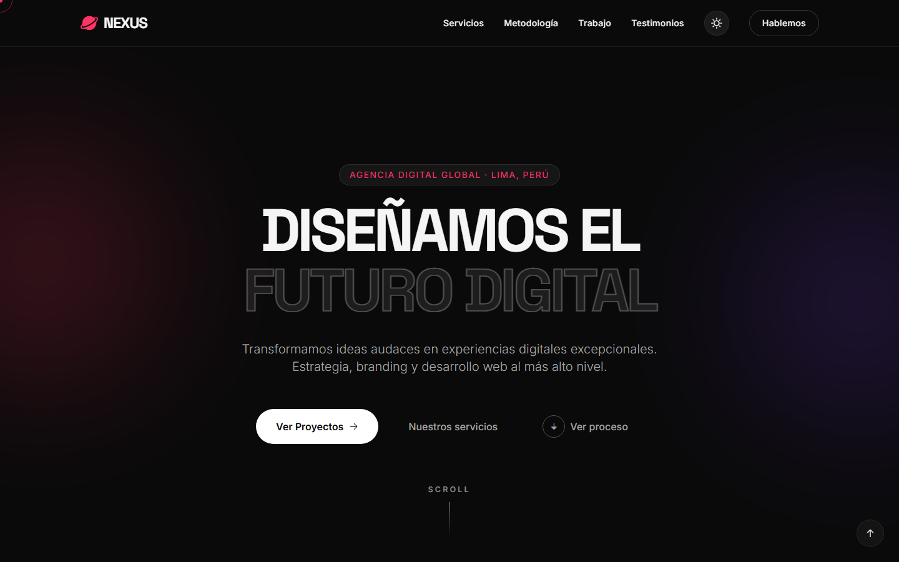
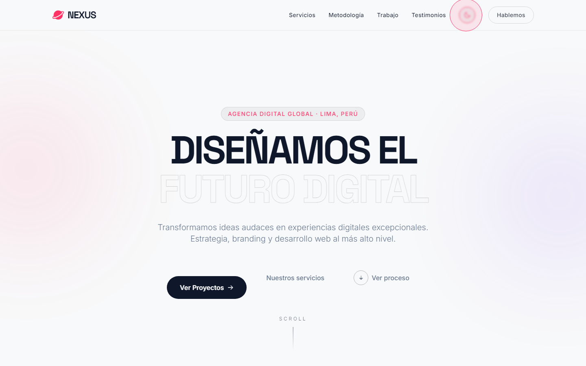
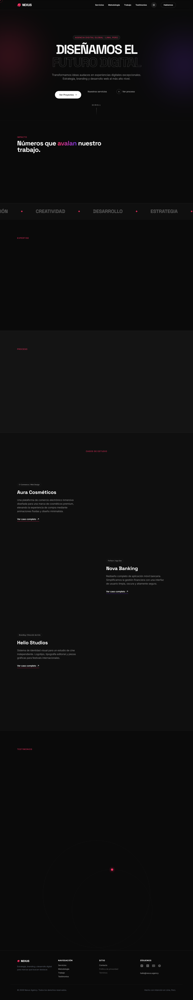
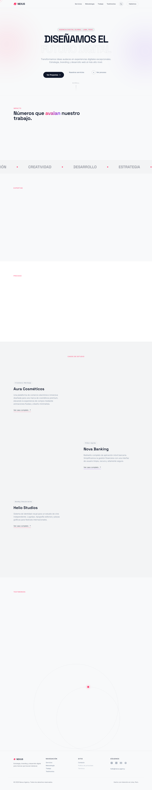
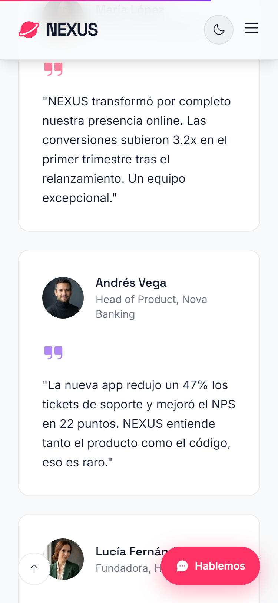
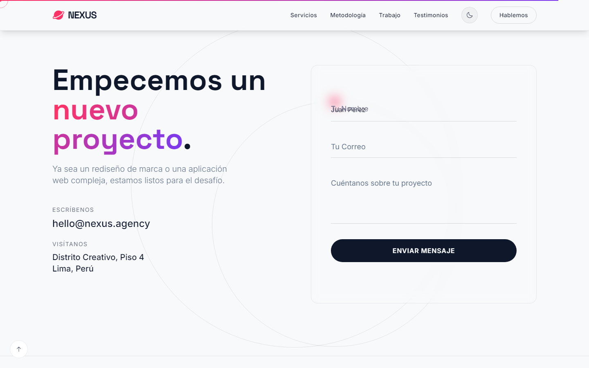
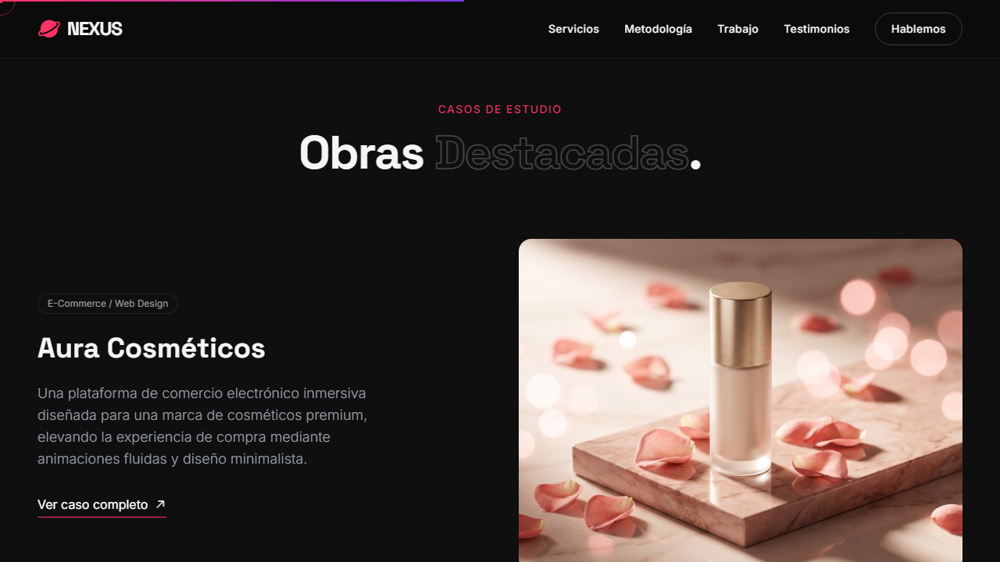
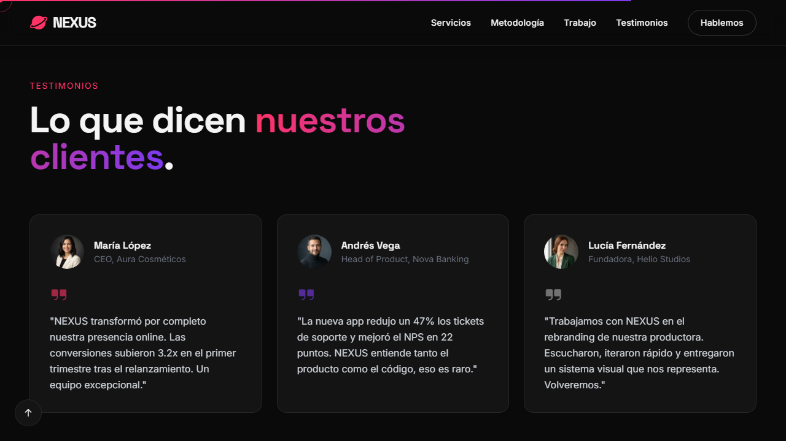

# NEXUS — Landing Page

Landing page de **NEXUS**, una agencia creativa global ficticia con sede en Lima, Perú. Single-file HTML con tema oscuro/claro, smooth scroll con Lenis, animaciones con GSAP, 7 secciones responsive y todos los assets gráficos generados a medida.

## Vista previa

| Modo oscuro | Modo claro |
| :---: | :---: |
|  |  |

| Página completa (dark) | Página completa (light) |
| :---: | :---: |
|  |  |

| Mobile | Form (light) |
| :---: | :---: |
|  |  |

| Sección Trabajo | Sección Testimonios |
| :---: | :---: |
|  |  |

---

## Acerca del proyecto

NEXUS es una página de aterrizaje de una sola página que sirve como demo de técnicas modernas de frontend:

- **Diseño editorial premium** — paleta oscura/luz, tipografía display (Space Grotesk) + body (Inter), jerarquía visual cuidada.
- **7 secciones** — Hero, métricas de impacto, marquee, servicios, metodología, trabajo, testimonios, contacto.
- **8 assets a medida** — todas las imágenes de proyectos y retratos fueron generadas con un modelo de imagen (`mcode-tools` / `generate_image`) y optimizadas a múltiples tamaños con `PIL` para servir vía `<picture>` + `srcset`.
- **Tema oscuro/claro** — toggle en el navbar, persistencia en `localStorage`, respeta la preferencia del sistema y sincroniza el `<meta name="theme-color">` con el estado.
- **Smooth scroll** — integrado con GSAP ScrollTrigger para que las animaciones de scroll se sincronicen con el scroll real.
- **Accesibilidad** — skip-link, `aria-expanded` / `aria-controls` en el menú móvil, focus trap, `prefers-reduced-motion` respetado, contraste WCAG AA en ambos modos.

## Stack

| Capa | Tecnología |
| :--- | :--- |
| Markup | HTML5 semántico (`<header>`, `<main>`, `<section>`, `<article>`, `<nav>`, `<footer>`) |
| Estilos | CSS3 con variables (`--color-bg`, `--color-text`, etc.) + **Tailwind CSS** (CDN runtime) para utilidades de layout |
| Tipografía | Google Fonts — **Space Grotesk** (display) + **Inter** (body) |
| Iconos | **Phosphor Icons** (webfont CSS) |
| Animaciones | **GSAP 3.12.2** + **ScrollTrigger** |
| Smooth scroll | **Lenis 1.1.13** (`lerp: 0.08`, integrado con `gsap.ticker`) |
| Imágenes | Generadas a medida, optimizadas con `PIL` (JPEG q82, progressive, srcset 800/1200/1920) |
| Build | Ninguno — single-file, listo para servir con cualquier static server |

## Cómo correrlo localmente

No requiere build. Cualquier servidor estático sirve:

```bash
# Opción 1 — Python
cd /ruta/al/repo
python -m http.server 5173
# Abrí http://localhost:5173/index.html

# Opción 2 — Node.js
npx http-server -p 5173

# Opción 3 — Netlify CLI
netlify dev

# Opción 4 — Abrí directamente
open index.html
```

> ⚠️ La página usa `<picture>` + `srcset` para imágenes responsivas, `IntersectionObserver` y `matchMedia`. Algunos features requieren un servidor (no funcionan con `file://` por las restricciones de CORS). Usá `python -m http.server` o similar.

## Estructura del proyecto

```
.
├── index.html                  # Página completa (CSS + JS inline, ~101 KB)
├── images/                     # 18 assets web-optimizados (3 tamaños × 6 imágenes)
│   ├── aura-cosmeticos-800.jpg
│   ├── aura-cosmeticos-1200.jpg
│   ├── aura-cosmeticos-1920.jpg
│   ├── nova-banking-800.jpg
│   ├── nova-banking-1200.jpg
│   ├── nova-banking-1920.jpg
│   ├── helio-studios-800.jpg
│   ├── helio-studios-1200.jpg
│   ├── helio-studios-1920.jpg
│   ├── maria-lopez-120.jpg
│   ├── maria-lopez-200.jpg
│   ├── maria-lopez-400.jpg
│   ├── andres-vega-120.jpg
│   ├── andres-vega-200.jpg
│   ├── andres-vega-400.jpg
│   ├── lucia-fernandez-120.jpg
│   ├── lucia-fernandez-200.jpg
│   ├── lucia-fernandez-400.jpg
│   └── src/                    # Originales full-res (2K / 1K) para re-optimizar
│       ├── aura-cosmeticos.jpg
│       ├── nova-banking.jpg
│       ├── helio-studios.jpg
│       ├── maria-lopez.jpg
│       ├── andres-vega.jpg
│       └── lucia-fernandez.jpg
├── docs/
│   ├── CHANGELOG.md            # Historia de las 3 versiones (v1 → v2 → v3)
│   └── screenshots/            # Capturas para el README
├── generate-args.json          # Prompts originales para regenerar las imágenes
├── optimize-images.py          # Script de optimización PIL (JPEG q82 + srcset)
├── .gitignore
└── README.md
```

## Cómo regenerar las imágenes

Si querés re-generar las imágenes con prompts distintos:

```bash
# 1. Generá imágenes nuevas con mcode-tools
mcode-tools connector call connector__matrix__generate_image --args-file generate-args.json
# (devuelve node_ids; usá get_asset_url para bajarlas)

# 2. Bajá las imágenes a images/src/
# (los nombres deben coincidir: aura-cosmeticos.jpg, nova-banking.jpg, etc.)

# 3. Re-optimizá a múltiples tamaños con PIL
python optimize-images.py
# → genera images/{name}-{800,1200,1920}.jpg y {name}-{120,200,400}.jpg
```

## Tema oscuro / claro

El sistema de temas está implementado con:

- **Variables CSS semánticas** — `--color-bg`, `--color-text`, `--color-muted`, `--color-surface`, etc. que cambian entre `:root` (dark) y `html.light`.
- **Tailwind** con `darkMode: 'class'` — los utility classes (`text-brand-muted`, `bg-brand-surface`, etc.) referencian las variables CSS para que el cambio sea instantáneo.
- **Preferencia persistida** en `localStorage` con la key `nexus_theme`. El default es dark (brand-first).
- **`prefers-color-scheme`** se respeta si no hay valor en `localStorage`.
- **FOUC prevention** — IIFE inline en `<head>` que setea la clase `light` antes del primer paint, según la preferencia persistida.
- **`<meta name="theme-color">`** se actualiza via JS cuando se hace toggle, para que el address bar de Safari cambie de color también.

## Accesibilidad

- Skip-link como primer elemento focusable.
- Menú móvil con `aria-expanded`, `aria-controls`, focus trap, retorno de foco al toggle, soporte de Escape, click-outside.
- `aria-current="page"` en el link de nav que corresponde a la sección actualmente en viewport (gestionado por ScrollTrigger).
- `aria-live="polite"` para el feedback de submit del form de contacto.
- `prefers-reduced-motion: reduce` — destruye Lenis, cancela todos los tweens de GSAP, las animaciones se renderizan instantáneamente.
- `:-webkit-autofill` override en ambos modos para evitar el flash amarillo de Chrome.
- Focus-visible global ring (`2px solid var(--color-accent)` con offset).
- Contraste WCAG AA verificado en ambos modos.

## Performance

- **JS** — Lenis + GSAP cargados con `defer` para no bloquear first paint.
- **Imágenes** — 18 variantes (3 tamaños por imagen) servidas vía `srcset` + `sizes`. El browser elige el archivo correcto según viewport y DPR.
- **Custom cursor** — usa `position: fixed` + `pointer-events: none` + `transform: translate3d` (composición GPU, no layout).
- **Lenis** — deshabilitado en `prefers-reduced-motion: reduce` para evitar jank.
- **Sin build step** — single-file de ~101 KB. Si se quisiera, Tailwind CLI puede precompilar el CSS y bajar el peso a ~30 KB.

## Licencia

MIT — usá, forké, rompé, mejorá. Las imágenes de `images/src/` son generadas a medida y son libres de derechos.

## Autor

Hecho por [CiaphasC](https://github.com/CiaphasC) — landing page demo de un sitio de agencia creativa.

---

> NEXUS es un proyecto demo. Toda la información de contacto, proyectos, clientes y métricas es ficticia.
